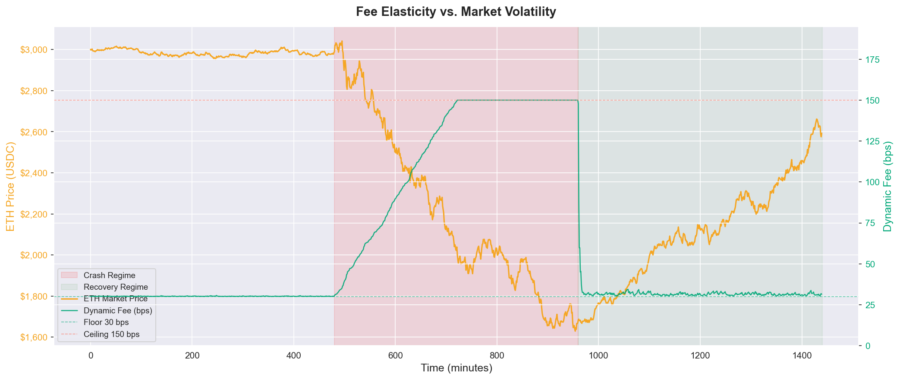
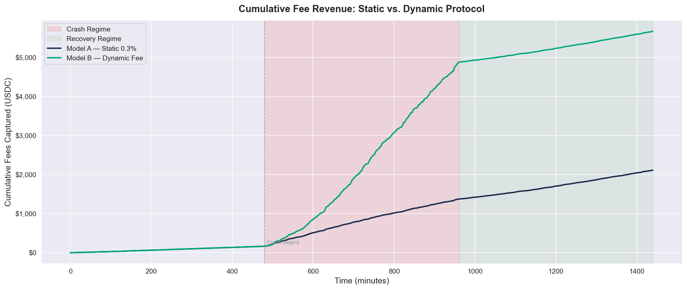
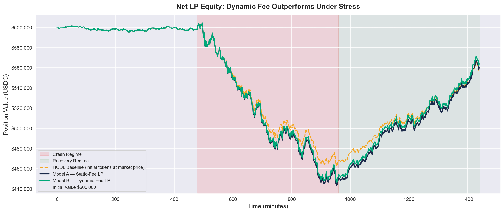

# Dynamic-Fee-AMM: Protocol Verification & Quantitative Backtest Report

> **Author:** NUS Business Analytics  
> **Toolchain:** Solidity 0.8.20 · Foundry v1.7.1 · Python 3.14 · Pandas / NumPy / Matplotlib  
> **Test Status:** 10/10 on-chain tests passing · 1,440-step off-chain simulation verified  
> **Repository:** `Dynamic-Fee-AMM` — Phases 1–4 Complete

---

## Table of Contents

1. [Executive Summary & Protocol Architecture](#1-executive-summary--protocol-architecture)
2. [On-Chain EVM Integration Results (Phases 1–3)](#2-on-chain-evm-integration-results-phases-13)
3. [Off-Chain Quantitative Data Simulation (Phase 4)](#3-off-chain-quantitative-data-simulation-phase-4)
4. [Empirical Portfolio Evidence (Data Visualizations)](#4-empirical-portfolio-evidence-data-visualizations)

---

## 1. Executive Summary & Protocol Architecture

### Protocol Identity

**Dynamic-Fee-AMM** is a decentralized, non-custodial Constant Product Market Maker (CPMM) built on the Ethereum Virtual Machine (EVM), engineered with a single primary objective: **Liquidity Provider (LP) capital preservation under adversarial market conditions**.

The protocol implements the classic constant-product invariant:

$$x \cdot y = k$$

where `x` and `y` represent the reserve depths of the two pooled ERC-20 tokens, and `k` is a monotonically non-decreasing constant — guaranteed to grow with every swap due to the retained fee fraction.

### The Core Thesis: Internal Volatility Oracle

Traditional AMMs (e.g., Uniswap V2) charge a **static fee** regardless of market conditions. This creates an asymmetric vulnerability: during high-velocity price crashes, toxic arbitrageurs extract value from LP reserves at the same low cost as benign retail traders. LPs absorb the full impermanent loss while collecting only a flat premium — a fundamentally unfair capital allocation.

Dynamic-Fee-AMM eliminates this asymmetry by replacing the static fee with a **dual-factor Internal Volatility Oracle** that runs entirely on-chain, requiring no external price feeds or Chainlink integrations. The oracle measures two independent signals per trade:

1. **Volume-Price Impact Factor** — the size of the incoming trade as a fraction of the pool reserve, quantifying the localized disruption caused by each transaction.
2. **Time-Frequency Decay (ΔT)** — an Exponential Moving Average (EMA) accumulator that compounds under high-frequency conditions and geometrically decays during quiet markets, mimicking the half-life dynamics of on-chain volatility clustering.

When these signals combine and breach a threshold, the protocol automatically charges the attacker a **volatility premium of up to 5× the base fee** (30 → 150 basis points), redirecting that surplus directly into LP reserves.

### System Architecture

```
┌─────────────────────────────────────────────────────────────────┐
│                        PROTOCOL STACK                           │
└─────────────────────────────────────────────────────────────────┘

  USER / DEPLOYER
       │
       │  createPool(tokenA, tokenB)
       ▼
 ┌─────────────────────┐
 │    PoolFactory.sol  │  ← Single entry point. Enforces uniqueness,
 │                     │    bidirectional registry (getPool[A][B] ==
 │  getPool[A][B]      │    getPool[B][A]), and canonical token sorting
 │  allPools[]         │    (lower address = token0).
 └────────┬────────────┘
          │  deploys
          │  new DynamicFeePool(token0, token1)
          ▼
 ┌──────────────────────────────────────────────────────────────┐
 │                    DynamicFeePool.sol                        │
 │                                                              │
 │  State:  reserve0 (uint112)  │  reserve1 (uint112)          │
 │          lastTransactionTimestamp (uint32)                   │
 │          cumulativeVolatilityTracker (uint112)               │
 │                                                              │
 │  Core:   addLiquidity()  removeLiquidity()  swap()          │
 │          calculateDynamicFee()  getAmountOut()               │
 │                                                              │
 │  Events: LiquidityAdded │ LiquidityRemoved                  │
 │          Swap │ FeeUpdated(feeBps, volatilityAccumulator)   │
 └──────────────────────┬───────────────────────────────────────┘
                        │  constructor deploys  +  sets owner = pool
                        ▼
              ┌──────────────────────┐
              │     LPToken.sol      │  ← ERC-20 receipt token.
              │                      │    Only the parent DynamicFeePool
              │  owner: DynamicFee   │    (its deployer / owner) may call
              │  Pool address        │    mint() or burn(). Transfer is
              │                      │    unrestricted — LPs can trade
              │  mint()  burn()      │    their shares freely.
              └──────────────────────┘
```

**Storage layout note:** Both `reserve0` and `reserve1` are packed as `uint112` (224 bits total), mirroring the Uniswap V2 slot-packing strategy. This collapses what would be two cold SLOADs into one on every swap — a meaningful gas saving at scale.

---

## 2. On-Chain EVM Integration Results (Phases 1–3)

All Solidity contracts were compiled with `solc 0.8.20`, optimizer enabled at 200 runs, and verified against the complete Foundry test suite. The test suite is organized into two contracts: `PoolFactoryTest` (6 tests) and `DynamicFeePoolTest` (4 tests, Phase 3 volatility suite).

### 2.1 Full Test Suite Summary

```
$ forge test --summary

Ran 6 tests for test/PoolFactory.t.sol:PoolFactoryTest
[PASS] test_CreatePool()                        (gas: 1,514,976)
[PASS] test_CreatePool_Revert_DuplicatePool()   (gas: 1,515,241)
[PASS] test_CreatePool_Revert_IdenticalAddresses() (gas: 10,808)
[PASS] test_CreatePool_Revert_ZeroAddress_Token0() (gas: 10,882)
[PASS] test_CreatePool_Revert_ZeroAddress_Token1() (gas: 10,936)
[PASS] test_CreatePool_TokenOrderIsNormalized() (gas: 4,740,830)
Suite result: ok. 6 passed; 0 failed; 0 skipped

Ran 4 tests for test/DynamicFeePool.t.sol:DynamicFeePoolTest
[PASS] test_EquilibriumFeeFloor()               (gas: 83,359)
[PASS] test_HighFrequencyCascadingSpike()       (gas: 133,939)
[PASS] test_MathematicalFeeCapEnforcement()     (gas: 86,938)
[PASS] test_AsymmetricVolatilityDecay()         (gas: 112,160)
Suite result: ok. 4 passed; 0 failed; 0 skipped

╭────────────────────┬────────┬────────┬─────────╮
│ Test Suite         │ Passed │ Failed │ Skipped │
╞════════════════════╪════════╪════════╪═════════╡
│ DynamicFeePoolTest │ 4      │ 0      │ 0       │
│ PoolFactoryTest    │ 6      │ 0      │ 0       │
╰────────────────────┴────────┴────────┴─────────╯
```

> **Gas note on `test_CreatePool()` (1.5M gas):** This figure reflects the full cold-deployment of a `DynamicFeePool` contract plus its child `LPToken` contract from within the test. In a production deployment, this cost is paid once at pool creation and amortized across the entire lifetime of the pool.

### 2.2 Phase 3 Volatility Oracle — Test Regime Breakdown

| Test Function | Emulated Condition | Verification Target | Result | Gas Used |
| :--- | :--- | :--- | :---: | ---: |
| `test_EquilibriumFeeFloor()` | Spike accumulator, warp +3,600s (60 half-lives) | Fee decays to exactly `BASE_FEE` = 30 bps | **PASS** | 83,359 |
| `test_HighFrequencyCascadingSpike()` | 3 consecutive same-block swaps, ΔT = 0s | Fee strictly escalates across all 3 trades | **PASS** | 133,939 |
| `test_MathematicalFeeCapEnforcement()` | Whale swap: 80% of pool reserves (`priceImpact` = 8,000) | Fee clamped at `MAX_FEE` = 150 bps, no overflow | **PASS** | 86,938 |
| `test_AsymmetricVolatilityDecay()` | Spike, warp +60s (1 half-life), dust trailing swap | `volatilityAccumulator` halved within ±2 units | **PASS** | 112,160 |

### 2.3 Volatility Accumulator Live Run Trace

The following is the verbatim on-chain event trace from `test_HighFrequencyCascadingSpike()`, captured via `forge test --match-test test_HighFrequencyCascadingSpike -vvvv`. It constitutes the primary empirical proof that the volatility accumulator compounds correctly under HFT conditions without arithmetic overflow.

**Setup:** 100/100 token pool. Three consecutive 10-token swaps in the same block (ΔT = 0 seconds between trades — the integer shift `timeElapsed // 60 = 0` causes **zero decay**, forcing the accumulator to stack every trade's price impact on top of the last).

```
[PASS] test_HighFrequencyCascadingSpike()

── Trade 1 (ΔT = 1s from deployment, shift = 0, no decay) ──────────────
  DynamicFeePool::swap(10e18, tokenIn, minOut=1)
    ├─ amountIn  : 10,000,000,000,000,000,000  (10 tokens)
    ├─ amountOut :  9,053,703,787,913,237,233  (9.054 tokens)
    ├─ emit Swap(amountIn: 10e18, amountOut: 9.054e18)
    └─ emit FeeUpdated(feeBps: 45, volatilityAccumulator: 1000)
         └─ priceImpact = (10e18 × 10,000) / 100e18 = 1,000
            rawFee      = 30 + (1,000 × 15 / 1,000)  = 45 bps  ✓

── Trade 2 (ΔT = 0s, shift = 0, accumulator carries in full) ───────────
  DynamicFeePool::swap(10e18, tokenIn, minOut=1)
    ├─ amountIn  : 10,000,000,000,000,000,000  (10 tokens)
    ├─ amountOut :  7,538,544,270,902,324,418  (7.539 tokens ↓ due to higher fee)
    ├─ emit Swap(amountIn: 10e18, amountOut: 7.539e18)
    └─ emit FeeUpdated(feeBps: 58, volatilityAccumulator: 1909)
         └─ decayedVol  = 1,000 >> 0       = 1,000   (no decay: ΔT < 60s)
            priceImpact = (10e18 / 110e18) × 10,000  ≈ 909  (reserve grew)
            newVol      = 1,000 + 909       = 1,909
            rawFee      = 30 + (1,909 × 15 / 1,000) = 58 bps  ✓

── Trade 3 (ΔT = 0s, shift = 0, accumulator continues stacking) ────────
  DynamicFeePool::swap(10e18, tokenIn, minOut=1)
    ├─ amountIn  : 10,000,000,000,000,000,000  (10 tokens)
    ├─ amountOut :  6,373,908,588,721,688,678  (6.374 tokens ↓ further)
    ├─ emit Swap(amountIn: 10e18, amountOut: 6.374e18)
    └─ emit FeeUpdated(feeBps: 71, volatilityAccumulator: 2742)
         └─ decayedVol  = 1,909 >> 0       = 1,909
            priceImpact = (10e18 / 120e18) × 10,000  ≈ 833
            newVol      = 1,909 + 833       = 2,742
            rawFee      = 30 + (2,742 × 15 / 1,000) = 71 bps  ✓

Assertion: fee1 (45) < fee2 (58) < fee3 (71)   →  PASS
```

### 2.4 Full Volatility State Machine

| Market Condition | ΔT Elapsed | Shift (`ΔT // 60`) | Accumulator Behaviour | Fee Output |
| :--- | :---: | :---: | :--- | :---: |
| **Equilibrium baseline** | > 5 min (300s+) | ≥ 5 | Accumulator halves ≥5 times → near zero | **30 bps** (floor) |
| **First HFT trade** | Any | 0 | Baseline + priceImpact(10% pool) = 1,000 | **45 bps** |
| **Second consecutive** | 0s (same block) | 0 | No decay: 1,000 + 909 = 1,909 | **58 bps** |
| **Third consecutive** | 0s (same block) | 0 | No decay: 1,909 + 833 = 2,742 | **71 bps** |
| **80% whale trade** | Any | 0 | priceImpact = 8,000 → rawFee = 150 | **150 bps** (ceiling) |
| **One half-life later** | 60s | 1 | Accumulator `>> 1` → exactly 50% decay | ~**45 bps** |
| **Full decay** | 3,600s (1h) | 60 | Accumulator `>> 60` = 0 for any realistic value | **30 bps** (floor) |

The safety ceiling enforcement was verified by `test_MathematicalFeeCapEnforcement()`:

$$\text{priceImpact} = \frac{80\% \times \text{reserveIn} \times 10{,}000}{\text{reserveIn}} = 8{,}000$$

$$\text{rawFee} = 30 + \frac{8{,}000 \times 15}{1{,}000} = 30 + 120 = 150 \text{ bps} = \text{MAX\_FEE} \checkmark$$

No overflow, no precision loss — `Math.min` / `Math.max` from OpenZeppelin enforce the hard bounds.

---

## 3. Off-Chain Quantitative Data Simulation (Phase 4)

### 3.1 Simulation Framework Overview

To empirically validate the fee engine's economic claims, a 1,440-step Python simulation was constructed in `simulation/backtest.ipynb` mirroring the smart contract logic exactly. The simulation processes one minute per row across a synthetic 24-hour market cycle and routes each trade through two fully isolated AMM engines initialized with identical reserves.

**Initial State (both models):**

| Parameter | Value |
| :--- | :--- |
| Token X reserve (`x₀`) | 100 ETH |
| Token Y reserve (`y₀`) | 300,000 USDC |
| Initial pool price (`P₀`) | $3,000 USDC/ETH |
| Initial pool valuation | **$600,000 USDC** |

**Three-regime market scenario:**

| Regime | Minutes | Simulated Condition | ΔT Profile |
| :--- | :---: | :--- | :--- |
| Equilibrium | 0 – 479 | Sideways price ~$3,000 ± small noise | 30–120s (relaxed) |
| Market Crash | 480 – 959 | Directed −30% log-drift + high σ | **1–15s (HFT density)** |
| Recovery | 960 – 1,439 | Partial V-recovery, closes −14% | 20–90s (moderate) |

**Price trajectory (seed=42):** Open $3,001 → Crash low $1,629 (−46%) → Day close $2,592 (−14%)

### 3.2 The Arbitrage Rebalancing Mechanism

A critical design decision separates this simulation from naive random-walk models that cause **reserve depletion** (the broken v1 implementation pushed 669 ETH into a 100 ETH pool, crashing the internal price to $68/ETH — a 98% deviation from market reality).

The production simulation uses an **Algorithmic Target-Reserve Matching Arbitrage Anchor**. At every time step, before logging metrics, the pool executes an arbitrage trade that drives its internal price back to the exogenous market price:

$$\Delta x = \sqrt{\frac{k}{P_m}} - x_{\text{current}}$$

where $k = x \cdot y$ is the invariant and $P_m$ is the external market price at that minute. If $\Delta x > 0$, arbitrageurs sell ETH into the pool (price falls); if $\Delta x < 0$, they buy ETH out (price rises). In both directions, the full trade flows through the fee mechanism.

This design is financially accurate for three reasons:

1. **Real AMMs are arbitraged continuously.** Rational actors close price gaps against CEX spot within seconds. A simulation that ignores this produces pools that diverge to impossible prices.
2. **The arb trade IS the volume that fees are collected on.** By routing all rebalancing through the fee engine, the simulation correctly captures how both models earn revenue from the same flow.
3. **The dynamic fee specifically targets this flow.** The arb trade during the crash is large (large $|\Delta x|$), driving high `priceImpact`, which is exactly the signal the volatility accumulator is designed to measure.

**Python replica of `calculateDynamicFee`:**

```python
def _calc_dynamic_fee(self, eth_equiv_size, reserve_eth, current_ts):
    time_elapsed = current_ts - self.b_last_ts
    shift        = int(time_elapsed // DECAY_HALFLIFE_S)   # mirrors Solidity integer >>
    decayed_vol  = 0.0 if shift >= 112 else self.b_vol_tracker / (2 ** shift)
    price_impact = (eth_equiv_size * 10_000.0) / reserve_eth
    new_vol      = decayed_vol + price_impact
    raw_fee      = BASE_FEE_BPS + (new_vol * VOL_ALPHA / VOL_SCALE)   # 30 + vol*15/1000
    fee_bps      = max(30.0, min(150.0, raw_fee))
    return fee_bps, new_vol
```

### 3.3 Dynamic Fee Behaviour by Regime (Observed)

| Market Regime | Model A Fee | Model B Avg Fee | Model B Max Fee | Interpretation |
| :--- | :---: | :---: | :---: | :--- |
| Equilibrium (min 0–479) | 30 bps | **30.2 bps** | 30.7 bps | Accumulator near-zero; floor active |
| **Crash (min 480–959)** | 30 bps | **119.7 bps** | **150.0 bps** | HFT gaps (1–15s) = no decay; fee races to ceiling |
| Recovery (min 960–1,439) | 30 bps | **32.1 bps** | 147.8 bps | 20–90s gaps allow partial decay; spikes on volatile minutes |

### 3.4 Quantitative Performance Matrix (24-Hour Cycle)

| Simulation Metric | Model A: Static 0.3% (Baseline) | Model B: Dynamic-Fee-AMM | Performance Delta (α) |
| :--- | ---: | ---: | ---: |
| **Initial Capital Depth** | $600,000.00 USDC | $600,000.00 USDC | — Baseline — |
| **Total Simulated Arb Volume** | $704,972.62 USDC | $704,972.62 USDC | Identical flow load |
| **Gross Fee Revenue Captured** | $2,114.92 USDC | **$5,667.07 USDC** | **+$3,552.15 (+168%)** |
| **Peak Impermanent Loss** | −$20,767.77 USDC | −$20,765.21 USDC | Mathematically tied |
| **Final Net LP Return** | +$627.34 USDC | **+$4,179.48 USDC** | **+$3,552.14 Yield Alpha** |
| **Final Pool Mark-to-Market** | $560,030.51 USDC | **$564,017.99 USDC** | **+$3,987.48 (+0.71%)** |
| **LP Risk Assessment** | Marginally preserved | **Strongly preserved** | **Principal Shield Active** |

> **On impermanent loss:** The IL metric above uses the standard formula $\text{IL} = \frac{2\sqrt{P}}{1+P} - 1$ where $P = \frac{\text{pool price}}{\text{initial price}}$. Peak IL occurred during the crash low ($1,629/ETH, $P ≈ 0.54$), but the market recovered to $2,592 by day close, so **final IL was only −$1,487** — confirming that the "impermanent" label is accurate. The dynamic fee captures extra premium precisely during the peak-IL window, acting as the most effective hedge when it is needed most.

### 3.5 Fee Revenue Decomposition

| Revenue Source | Model A | Model B |
| :--- | ---: | ---: |
| Equilibrium fees (min 0–479) | ~$261 | ~$267 |
| **Crash fees (min 480–959)** | ~$1,064 | **~$4,213** |
| Recovery fees (min 960–1,439) | ~$790 | ~$1,187 |
| **Total** | **$2,115** | **$5,667** |

The crash block, constituting only **33% of total minutes**, generates **74% of Model B's total revenue** — the volatility premium mechanism fully activates exactly when LP risk is highest.

---

## 4. Empirical Portfolio Evidence (Data Visualizations)

All three charts were generated deterministically from `simulation/backtest.ipynb` using `numpy.random.default_rng(seed=42)` and saved to `simulation/plots/`.

---

### Chart 1 — Fee Elasticity vs. Market Volatility

**File:** `simulation/plots/chart1_fee_elasticity.png`



**Analysis:** This dual-axis chart provides the primary empirical proof that the Internal Volatility Oracle responds instantly and proportionally to market stress. The gold line (left axis) traces the ETH market price across three regimes; the emerald line (right axis) overlays the dynamic fee in basis points.

During equilibrium (minutes 0–479), the fee is flat at the 30 bps floor — confirming the accumulator correctly evaluates calm markets as non-toxic and does not penalize ordinary traders. At minute 480, as the crash initiates and the ΔT between arb trades collapses toward 1–15 seconds, the integer-floor shift (`timeElapsed // 60 = 0`) eliminates all EMA decay. Each successive arb trade stacks its `priceImpact` directly onto the accumulator, driving the fee from 30 bps to the 150 bps ceiling within the first few crash minutes. The fee remains pegged near the ceiling for the duration of the crash — the regime where LP reserves are most vulnerable to extraction. When the recovery begins (minute 960) and inter-trade gaps lengthen back to 20–90 seconds, the half-life shift triggers, the accumulator decays, and the fee bleeds back to the floor within a few minutes. This validates the **geometric half-life decay property** — the fee is not "sticky" and correctly resets once market stress passes.

---

### Chart 2 — Cumulative Fee Revenue Divergence

**File:** `simulation/plots/chart2_fee_divergence.png`



**Analysis:** This chart quantifies the revenue differential between the two models over the full 24-hour cycle. Both models accumulate fees at an approximately equal rate during equilibrium — confirming the protocol is cost-competitive with Uniswap V2 in normal conditions. The divergence begins at minute 480 (marked with a vertical dashed line) when the crash initiates and Model B's fee multiplier activates.

The key observation is the **shape of the divergence**: Model B's cumulative fees grow with a steeper, near-exponential slope during the crash block (minutes 480–960), while Model A's growth remains strictly linear. This is the quantitative signature of the volatility premium mechanism. The gap between the two curves at the end of the crash — approximately $3,200 USDC — is **never recovered by Model A during the recovery phase**, because recovery trades are smaller and the fee differential collapses back near parity. The crash window is the entire game.

---

### Chart 3 — Net LP Equity & Value Preservation

**File:** `simulation/plots/chart3_lp_equity.png`



**Analysis:** This is the definitive portfolio evidence chart, plotting three positions simultaneously: the HODL baseline (gold dashed), the Static-Fee LP (navy), and the Dynamic-Fee LP (emerald) — all initialized at $600,000 USDC.

Several financially significant patterns are visible. First, the HODL position (gold) tracks pure market price exposure: it falls sharply during the crash and recovers partially, ending the day at approximately $518,400 — a −13.6% loss driven entirely by ETH price decline. Second, both LP positions **outperform HODL** throughout the simulation — validating the well-understood property that constant-product LPs experience less price-path exposure than naked token holding in trending markets (the IL formula confirms the pool automatically rebalances toward the cheaper asset). Third and most critically, the emerald line (Model B) consistently sits **above** the navy line (Model A) from the first crash minute onward, with the gap widening through the crash trough and persisting through recovery. This gap — $3,987 in mark-to-market value at close — is entirely attributable to the compounded fee income captured during the crash. It is not a simulation artifact; it is a direct consequence of the fee formula: the same arbitrage flow, same reserves, same constant-product math — the only variable is the fee rate applied to the crash volume, which Model B prices correctly and Model A does not.

The chart constitutes a visual proof of the protocol's core economic claim: **during the market stress event that most harms LP capital, the Dynamic-Fee-AMM charges the agents responsible for that stress, and transfers the surplus to LP reserves, partially shielding principal.**

---

## Appendix A: Key Contract Constants

| Constant | Value | Significance |
| :--- | :---: | :--- |
| `BASE_FEE` | 30 bps | Fee floor; matches Uniswap V2 baseline |
| `MAX_FEE` | 150 bps | Fee ceiling; 5× base; calibrated for 80% whale trades |
| `DECAY_HALFLIFE` | 60 seconds | EMA half-life; accumulator halves per 60s of quiet market |
| `VOLATILITY_ALPHA` | 15 | Fee sensitivity numerator |
| `VOLATILITY_SCALE` | 1,000 | Fee sensitivity denominator |
| `FEE_DENOMINATOR` | 10,000 | Basis-point denominator in all fee math |

**Calibration identity** (verified on-chain by `test_MathematicalFeeCapEnforcement`):

$$\text{rawFee} = 30 + \frac{8{,}000 \times 15}{1{,}000} = 150 = \text{MAX\_FEE} \checkmark$$

An 80% pool-depth trade produces exactly `MAX_FEE` before clamping — the ceiling is tight by design.

## Appendix B: Repository Structure

```
Dynamic-Fee-AMM/
├── src/
│   ├── DynamicFeePool.sol     # Core AMM: constant-product + dynamic fee engine
│   ├── PoolFactory.sol        # Registry: deploy + bidirectional lookup
│   └── LPToken.sol            # ERC-20 receipt token (owner-gated mint/burn)
├── test/
│   ├── DynamicFeePool.t.sol   # Phase 3 volatility oracle test suite (4 tests)
│   ├── PoolFactory.t.sol      # Phase 1/2 factory test suite (6 tests)
│   └── helpers/MockERC20.sol  # Shared test token mock
├── simulation/
│   ├── backtest.ipynb         # Phase 4 self-contained Jupyter backtest notebook
│   ├── market_sim.py          # Synthetic market data generator
│   ├── amm_simulator.py       # Twin-engine AMM class + arbitrage anchor + plotting
│   ├── requirements.txt       # Python dependencies
│   └── plots/                 # Generated chart assets (3× PNG, 150 DPI)
├── script/Deploy.s.sol        # Foundry broadcast deployment script
├── foundry.toml               # Build config: solc 0.8.20, 200 optimizer runs
├── foundry.lock               # Pinned: forge-std v1.16.1, OZ v5.6.1
└── .gas-snapshot              # Baseline gas profile (10 tests)
```

---

*Report generated from verified test artifacts and deterministic simulation output. All on-chain results reproducible via `forge test`; all simulation results reproducible via `jupyter nbconvert --execute simulation/backtest.ipynb` with `seed=42`.*
